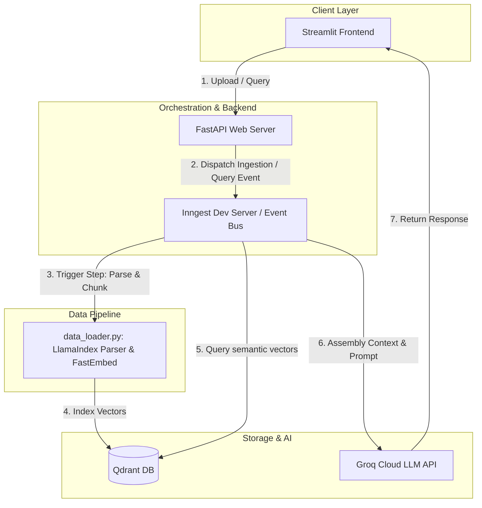

# RAG Production Engine

[](https://www.python.org/)
[](https://fastapi.tiangolo.com/)
[](https://www.inngest.com/)
[](https://qdrant.tech/)
[](LICENSE)

An event-driven, production-grade Retrieval-Augmented Generation (RAG) system engineered for high-throughput document ingestion, local CPU semantic embedding, and sub-second question answering. Powered by FastAPI, Inngest orchestration, local Qdrant Vector Storage, and Groq Cloud LLM inference.

---

## 📖 Problem Statement & Motivation

Many enterprise RAG applications suffer from poor reliability and cost bloat. Ingestion pipelines often block web application threads due to heavy CPU-bound parsing and embedding tasks. Furthermore, cloud embedding APIs are expensive, and network requests can fail unpredictably, leading to incomplete data states. 

**RAG Production Engine** solves these challenges by:
*   **Asynchronous Orchestration:** Moving heavy PDF chunking and vector indexing out of the request-response cycle using Inngest workflows.
*   **Local On-Device Embeddings:** Generating vectors locally via ONNX Runtime using Qdrant’s FastEmbed library—offering zero-cost, private semantic representations.
*   **Reliable Event Queues:** Ensuring that transient network failures during LLM synthesis are retried automatically with backoff, eliminating lost operations.

---

## ⚡ Features

*   **Reliable Ingestion Workflows:** Rate-limited and throttled async pipelines managed by Inngest.
*   **Zero-Cost Local Embeddings:** High-speed, local CPU text embeddings using the `BAAI/bge-small-en-v1.5` model (384 dimensions) via FastEmbed.
*   **Strict Context Control:** Precise token parsing using LlamaIndex's `SentenceSplitter` to isolate and feed relevant data to the LLM.
*   **Hardware-Optimized Vector Retrieval:** Integrated with Qdrant for lightning-fast similarity search using Cosine distance.
*   **Sub-Second LLM Reasoning:** Semantic context-grounded response generation via Groq Cloud using Llama-3.

---

## 🏗️ High-Level Architecture

The following diagram illustrates the flow of a document from upload to ingestion, and a query from submission to answer synthesis:



---

## 🛠️ Tech Stack

*   **Language:** Python 3.11
*   **API Framework:** FastAPI
*   **Orchestration Engine:** Inngest
*   **Vector Database:** Qdrant (Local Docker Image)
*   **Embedding Framework:** FastEmbed (ONNX Runtime)
*   **Data Parsing:** LlamaIndex Core & PDF Reader
*   **Dependency Manager:** uv (Rust-based workspace optimizer)
*   **Frontend Interface:** Streamlit

---

## 🚀 Local Development

Follow these steps to set up and run the application on your local machine.

### Prerequisites
Make sure you have the following installed:
*   Python 3.11+
*   Docker Desktop (for running Qdrant)
*   Node.js (for running the Inngest Dev Server)
*   `uv` (optional, for fast package management)

### 1. Clone & Install Dependencies
```bash
# Clone the repository
git clone https://github.com/illuminatiAyush/RAG-APP.git
cd RAG-APP

# Create a virtual environment and install dependencies using uv
uv sync
```

### 2. Configure Environment Variables
Copy `.env.example` to `.env` and fill in your keys:
```bash
cp .env.example .env
```
Ensure `.env` contains your active Groq API Key:
```env
GROK_API_KEY=gsk_your_groq_key_here
```

### 3. Spin up Vector Store (Qdrant)
Start Qdrant inside a Docker container:
```bash
docker run -p 6333:6333 -v $(pwd)/qdrant_storage:/qdrant/storage qdrant/qdrant
```

### 4. Run Inngest Dev Agent
```bash
npx inngest-cli@latest dev
```

### 5. Start Backend Server
```bash
uv run uvicorn app.main:app --reload --port 8000
```

### 6. Run Streamlit UI
```bash
uv run streamlit run streamlit_app.py
```
Open `http://localhost:8501` to access the application dashboard.

---

## 📈 Performance & Production Considerations

*   **CPU Ingestion Limits:** For high-throughput production settings, offload local embeddings (`fastembed`) from the core web process to a separate celery/worker deployment equipped with GPUs.
*   **Rate Limits:** The ingestion API is throttled to 2 executions per minute to avoid CPU spikes during document parsing.
*   **Qdrant Persistence:** All vector schemas are persistent and saved locally inside `qdrant_storage/` in your workspace.

---

## 📄 License

This project is licensed under the MIT License - see the [LICENSE](LICENSE) file for details.
