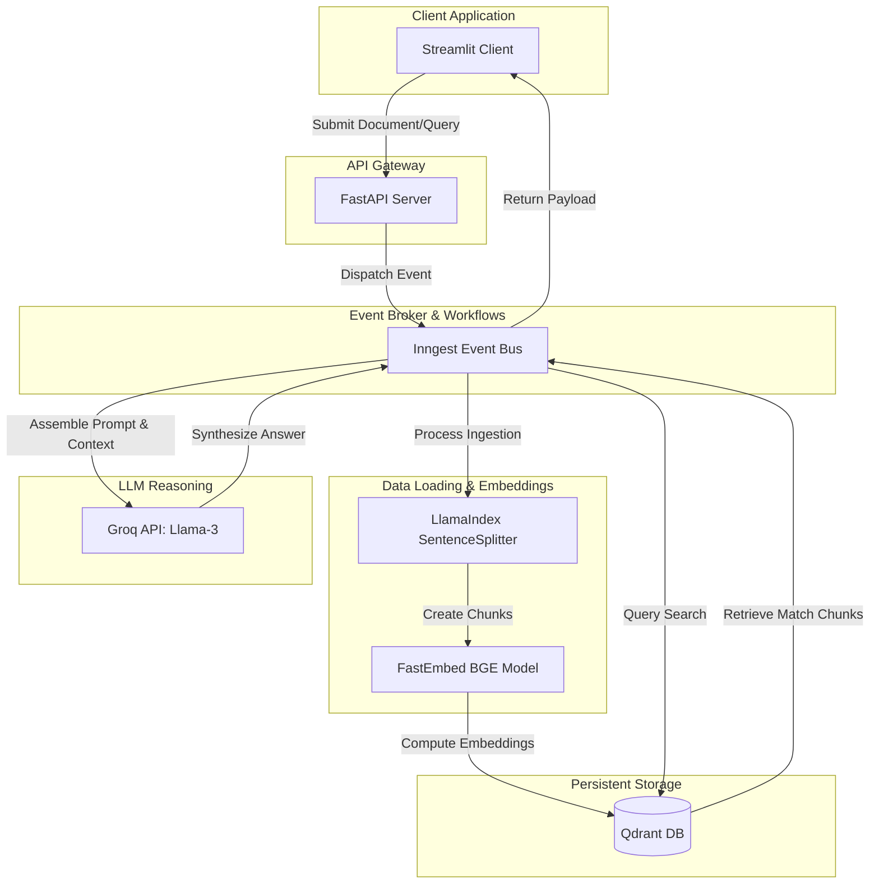
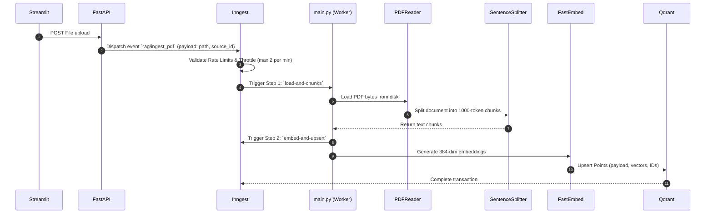

# Architectural Design & System Topography

This document details the architectural decisions, design choices, system topography, and structural data flows of the RAG Production Engine.

---

## 1. System Overview

### Why RAG (Retrieval-Augmented Generation)?
Traditional Large Language Models (LLMs) suffer from temporal knowledge cutoffs and lack access to private, proprietary datasets. Fine-tuning models on custom data is slow, expensive, and risks catastrophic forgetting. 

Retrieval-Augmented Generation (RAG) circumvents these limitations by decoupling the **knowledge base** from the **reasoning model**. When a query is made, relevant context chunks are fetched from a secure local vector index and injected directly into the LLM's prompt context. This ensures that the generated answer is grounded in factual, private reference materials, drastically reducing hallucinations.

### Why Vector Databases?
Standard relational databases (e.g., PostgreSQL with text index) or document stores (e.g., Elasticsearch) are built for exact keyword matching. They fail to understand semantic meaning (e.g., connecting "Staffing constraints" to "having no employees"). 

Vector databases store text as high-dimensional numerical coordinates (embeddings) representing semantic concepts. They use specialized index structures like **HNSW (Hierarchical Navigable Small World)** to perform fast nearest-neighbor calculations (using Cosine distance or Dot Product) to retrieve context based on conceptual similarity rather than exact spelling.

---

## 2. High-Level Architecture

The system utilizes an asynchronous event-driven layout to segregate long-running CPU-bound pipeline processes from HTTP endpoints.

---

## 3. Component Responsibilities & Tradeoffs

### 3.1. API Layer: FastAPI
FastAPI was selected as the front API gateway due to its asynchronous design and Pydantic validation rules.
*   **Alternatives Considered:** Flask, Django, Express.
*   **Tradeoffs:** While Flask is simpler, it lacks native `async/await` execution models out of the box. Running CPU-bound tasks in standard Flask blocking calls would lock thread workers, causing API timeouts. FastAPI’s integration with Uvicorn handles async concurrency efficiently.

### 3.2. Background Workflows: Inngest
Inngest acts as the system's workflow engine, managing failure recovery, retries, and rate limiting.
*   **Alternatives Considered:** Celery, Temporal, RabbitMQ.
*   **Tradeoffs:** 
    *   *Celery* requires separate broker (Redis/RabbitMQ) and worker processes, adding complex infrastructure management.
    *   *Temporal* is extremely powerful but represents massive operational complexity (requiring a separate database and cluster).
    *   *Inngest* runs serverless or via a local agent, registering handlers via standard HTTP endpoints (`/api/inngest`), simplifying setup while providing native step-level retries and rate limits.

### 3.3. Vector Storage: Qdrant
Qdrant serves as our vector storage engine due to its performance, Rust-based efficiency, and rich payload-filtering capabilities.
*   **Alternatives Considered:** Pinecone, Weaviate, Milvus.
*   **Tradeoffs:** Pinecone is closed-source and cloud-only, presenting data privacy issues. Weaviate is excellent but heavier on memory. Qdrant is open-source, supports native local persistent Docker runtimes, and offers a robust Python client.

### 3.4. Embeddings: FastEmbed
FastEmbed (by Qdrant) generates vector representations locally on CPU using optimized ONNX runtimes.
*   **Alternatives Considered:** OpenAI Embeddings (`text-embedding-3-small`).
*   **Tradeoffs:** Using OpenAI embeddings introduces API costs and network overhead. FastEmbed runs `BAAI/bge-small-en-v1.5` locally, delivering fast vectors on standard CPU threads for free, with negligible performance degradation for standard text retrieval tasks.

### 3.5. Parsing: LlamaIndex
LlamaIndex manages parsing and document layout chunking.
*   **Alternatives Considered:** LangChain.
*   **Tradeoffs:** LangChain is vast and can be bloated. LlamaIndex is highly specialized for index-centric tasks, offering robust document parsers (`PDFReader`) and clean, token-aware chunk splitters (`SentenceSplitter`).

---

## 4. Data Flow Sequences

### 4.1. PDF Ingestion Flow

### 4.2. Failure & Retry Flow
1. If a step (such as embedding or Qdrant write) fails due to database connection loss or rate limits, the step throws an exception.
2. Inngest catches the exception and schedules a retry using exponential backoff (e.g., 5s, 15s, 45s...).
3. Because steps are **idempotent** (UUIDs are generated deterministically using namespace UUIDv5 of `source_id:chunk_index`), retried database writes simply overwrite the target index, preventing duplicate chunks in Qdrant.

---

## 5. Scalability Considerations

1. **Horizontal Scaling of Workers:** In production, the FastAPI web app and the Inngest runner worker processes should be separated. FastAPI handles metadata and dispatches events, while Inngest execution workers run on compute-optimized VMs.
2. **GPU Embedding Services:** While local FastEmbed on CPU is sufficient for development, production pipelines handling thousands of concurrent pages should offload embedding requests to a centralized embedding service (e.g., TEI - Text Embeddings Inference by Hugging Face) backed by NVIDIA GPUs.
3. **Multi-Tenancy:** To isolate tenant data, Qdrant payload filters can be configured. Each point stores a `tenant_id` in its payload, and the query API dynamically applies a `Filter(must=[FieldCondition(key="tenant_id", match=MatchValue(value=tenant_id))])` to guarantee logical isolation within a shared collection.
